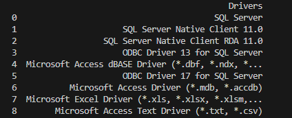

# pyql
A query tool for SQL Server

## Usage
#### First, define your sql connection
```python
import pyql

conn = pyql.SqlConn("<ODBC DRIVER>",
                    "<SERVER>\\<INSTANCE>",
                    "<DATABASE>",
                    "<USERNAME>>",
                    "<PASSWORD>)")
```
#### If you need an easy way to find your odbc drivers, use...
```python
pyql.get_drivers()
```
<br>
#### A simple select * query
```python
p = pyql.Select("Users")
```
```sql
SELECT * FROM USERS
```

